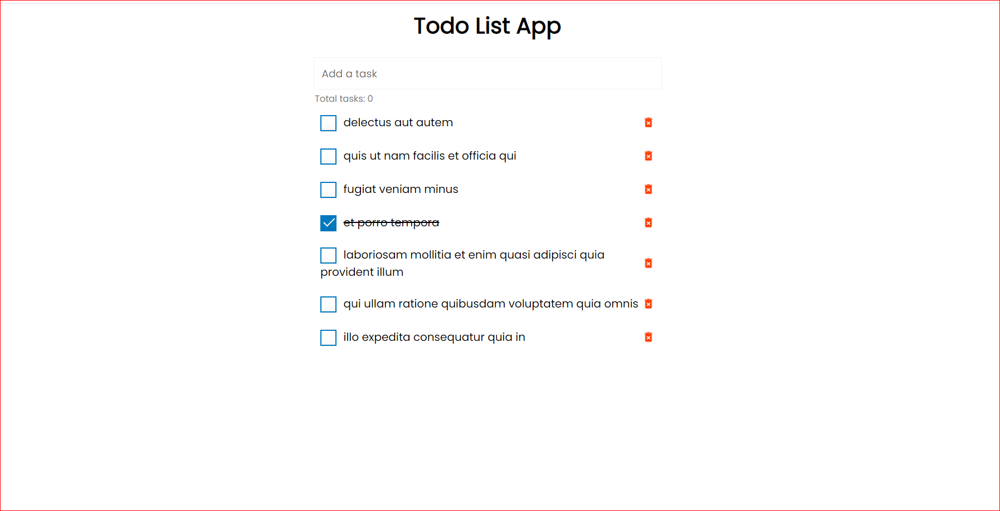

# Project Description

The "todo-api" project is a simple to-do list application that allows users to add, mark as completed, unmark, and delete tasks. The application is built using JavaScript, specifically the Fetch API, for the back-end functionality, and HTML and CSS for the front-end design.

## Installation Instructions

1. Clone or download the repository to your local machine
2. Install the necessary dependencies by running `npm install` in the project's root directory
3. Start the development server by running `npm start`

## Usage Instructions

- To add a task, enter the task in the input field and click the "Add Task" button.
- To mark a task as completed, click the checkbox next to the task.
- To unmark a completed task, uncheck the checkbox next to the task.
- To delete a task, click the "Delete" button next to the task.

## Additional Features

- Persistence of data across browser sessions using LocalStorage

## Contributors

- [Your Name](https://github.com/username)

## Contribute

If you would like to contribute to this project, please fork the repository and make your changes. Once you have made your changes, please create a pull request and I will review and merge your changes.

## Screenshopt

## Live Version

You can see a live version of the project running at https://vikramkbgs.github.io/todo-api/
